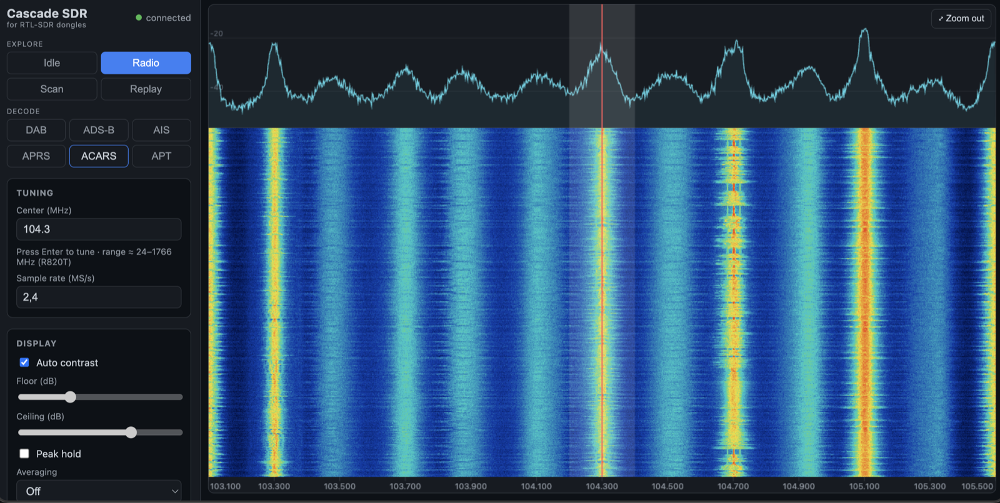
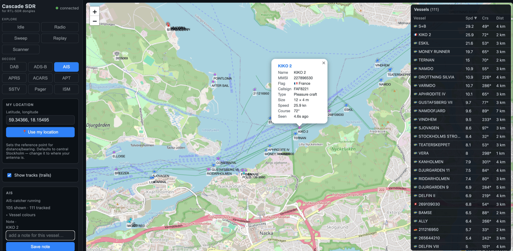

# Cascade SDR

A cross-platform receiver app **for RTL-SDR dongles** (RTL2832U + R820T/R820T2,
~24–1766 MHz). It is **RTL-SDR specific** — other SDRs (Airspy, HackRF, SDRplay,
…) are not supported. A small **Python backend** owns the dongle and does the
signal processing; a **web frontend** (opened in a browser) shows the UI,
waterfall, audio and maps. The two talk over a WebSocket.



📖 **New here? See the [User Guide](docs/GUIDE.md)** — how to use every mode, plus
things to try. Status:

| Mode | What it does | Status |
|------|--------------|--------|
| **Radio** | Live scrolling waterfall + scope; **click a signal to listen** (WFM/NFM/AM/USB/LSB/CW), squelch, browser audio. Scroll to zoom. | ✅ working |
| **Sweep** | Swept wideband panorama (e.g. whole 88–108 band) to find signals | ✅ working |
| **Scanner** | Cycle a channel preset (Marine VHF / PMR446 / Airband) and stop on a transmission | ✅ working |
| **Replay** | Play a saved `.cu8` capture back through the spectrum + demodulators — no dongle needed | ✅ working |
| **DAB** | DAB/DAB+ digital radio — ensemble station list + playback (via `welle-cli`) | ✅ working† |
| **ADS-B** | Aircraft on a Leaflet map (via `dump1090`) | ✅ working* |
| **AIS** | Ships on a Leaflet map (via `AIS-catcher`) | ✅ working** |
| **APRS** | Packet-radio stations on the map (via `rtl_fm` → `direwolf`) | ✅ working‡ |
| **ACARS** | Aircraft VHF data messages as a live feed (via `acarsdec`) | ✅ working§ |
| **APT** | NOAA weather-satellite images at 137 MHz (hand-written decoder) | ✅ working¶ |
| **433 MHz** | 433.92 MHz ISM devices — weather stations, TPMS, sensors, remotes (via `rtl_433`) | ✅ working‖ |

\* Needs `dump1090` installed (`brew install dump1090-mutability`) **and a decent
1090 MHz antenna** — the stock whip barely hears ADS-B. The pipeline runs and
plots aircraft when it receives them; with the stock antenna you may see none.

\*\* Needs `AIS-catcher` (build from source, see below). AIS (162 MHz) works with a
normal VHF/whip antenna near water. **By default we pass `-X off` so your received
data is NOT uploaded to the aiscatcher.org community feed.**



### Using the Radio view (waterfall + listen in one)
Open the app and click **Radio**: you see the live waterfall + scope of the
captured band, silent. **Click any signal to listen** — audio starts and the demod
controls appear. **Drag across a signal** to set its bandwidth. A live **spectrum
scope** sits above the waterfall (dBFS vs frequency) and a **squelch** slider mutes
the audio when the channel level falls below the threshold (the level meter shows
the current channel level and ▶/🔇). Adjust demod (FM/AM), bandwidth and volume in
the Radio controls. The dongle stays on one center frequency and captures ~2.4 MHz;
you're selecting channels *within* that band digitally — type a frequency in
**Center** (Enter) to move the captured window.

> Radio is one combined view: it's both "browse the band" and "listen." It
> stays silent until you click a signal, so it doubles as a plain waterfall.

Audio uses a ~120 ms jitter buffer to stay click-free. The device is read on a
dedicated thread (kept drained at real time) so DSP never starves the USB stream.

### Finding signals with Sweep
The dongle only sees ~2.4 MHz at once, so **Sweep** sweeps it across a wider range
(set *Sweep from/to* in MHz, or pick a **preset** like FM 88–108 or Airband) and
stitches the slices into one wide spectrum + waterfall. **Click any peak** to
re-center the dongle there and drop straight into the Radio view to listen. Wider
ranges sweep more slowly (each ~2.4 MHz slice needs its own retune + capture).

### Scanner (monitor channels, stop on activity)
Select **Scanner** and pick a **preset** — **Marine VHF** (Ch 16 + ship-to-ship +
Swedish leisure/fishing), **PMR446**, or **Airband** (AM). It cycles the channels,
watching every channel in a 2.4 MHz block at once via one FFT, and **parks on the
first that breaks squelch**, playing it until it's quiet for a few seconds, then
resumes. Each channel shows a live **signal bar** so you can set **squelch (dB over
noise)** by eye — lower it if wanted calls don't stop, raise it if it stops on
noise. Marine VHF needs a VHF/marine antenna; Ch 16 is the easiest to test with.

### Replay a recording
Select **Replay** and click a saved `.cu8` capture: it streams the file back
through the same Radio view and demodulators (looping at the end), so you can
re-open a capture and pull out *any* signal in the recorded band — **no dongle
needed**. Click a signal to listen, drag to set bandwidth, scroll to zoom, just
like live. The capture's center frequency and sample rate come from its filename.

### Zoom, gain, PPM
- **Scroll** (mouse wheel) over the scope/waterfall to **zoom** the display into
  part of the captured band; **shift-drag** to pan; **Zoom out** (top-right) resets.
  This is a *display* zoom — it magnifies what's captured without retuning. (In
  **Sweep**, drag still narrows the swept range; plain **drag** in the Radio view
  sets demod bandwidth.)
- **Gain** — uncheck *Auto gain* for a manual slider over the device's gain steps.
  High manual gain helps weak signals (e.g. ADS-B); too much overloads.
- **PPM correction** — RTL-SDR crystals are off by tens of ppm; set this so the
  displayed/tuned frequency is accurate (important for narrowband + digital modes).

### Demodulators
Radio supports **WFM** (broadcast), **NFM** (narrow — ham/marine/PMR voice),
**AM** (carrier-normalised), **USB/LSB** (SSB, with AGC), and **CW** (Morse —
plays the tone and **decodes it to text** in an overlay; best on clean signals,
self-calibrates after a character or so). Switching demod sets a sensible default
bandwidth you can then fine-tune. For WFM, **FM stereo** (on by default — decodes
the 38 kHz L−R subcarrier when a 19 kHz pilot is present, falling back to mono
otherwise; a "◖◗ stereo" indicator shows when locked), an **FM de-emphasis**
selector picks 50 µs (Europe) or 75 µs (Americas/Korea), and **RDS** decoding (on by default)
shows the **station name, radiotext, PI code and program type** from the 57 kHz
data subcarrier — hand-written decoder (pilot PLL → coherent BPSK → biphase /
differential → block-syndrome sync → group parsing), no external tool.

### Recording
- **Audio**: the *Record audio* button (Radio controls) captures what you're
  hearing to a **WAV** download.
- **IQ**: *Record IQ* (Recording panel, Radio view) writes the raw stream to a
  standard **.cu8** file — replayable in Cascade's own **Replay** mode, or in
  rtl_sdr/gqrx/etc. — listed with download/delete; the filename carries the center
  frequency and sample rate.

### Antenna helper (dipole kit)
Under the band label, a live hint tells you how to set the **RTL-SDR.com dipole
antenna kit** for the entered/tuned frequency: whether to use the **long (large)**
or **short (small)** telescopic elements, the length to extend each to (≈ a
quarter wave, `length_cm ≈ 7125 / f_MHz` less the 2 cm internal), and the
**orientation** (vertical for terrestrial signals; a horizontal "V" for 137 MHz
weather satellites). It updates as you type a Center frequency.

### Display, bookmarks, persistence
- **Band label**: under the device status it names the service(s) on the current
  frequency range (FM broadcast, Airband, Marine VHF, 2 m/70 cm ham, TETRA, DAB,
  ADS-B, …) so you know what kind of traffic to expect (EU/Sweden band plan).
- **Display** panel: **Auto contrast** (or manual floor/ceiling dB) for the
  waterfall, **Peak hold** on the spectrum scope — peaks linger then fade over
  ~1–2 s so brief/bursty signals flash and are easy to spot — and **Averaging**
  (2–16×) to smooth the scope's noise floor so weak, steady carriers stand out.
- **Bookmarks**: save the current frequency (+ demod) with a name; click to recall,
  × to delete.
- **Settings persist** across reloads (gain, PPM, bias-T, demod, volume, squelch,
  contrast, peak-hold, sweep range, receiver location, bookmarks) via localStorage.

### Layout
Controls live in the left sidebar; the spectrum scope + waterfall fill the rest of
the window and resize with it.

### ADS-B (aircraft map)
Select **ADS-B**: the backend spawns `dump1090`, reads its BaseStation feed
(TCP 30003), and plots aircraft on an OpenStreetMap map. Switching to another mode
kills `dump1090` and hands the dongle back. **Bias-T** (Reception ▸ Advanced) can power a
1090 MHz LNA — strongly recommended for real range. Gain/PPM are passed to dump1090.
Click a plane or a row in the **Aircraft** list for full detail (callsign, ICAO,
**type/category** — light/small/large/heavy/rotorcraft, squawk, altitude, climb,
speed, track); the list is sorted by distance from your location (set it in the
ADS-B panel). Each aircraft also draws a **track trail** as it moves.

### DAB radio (†)
Select **DAB**, pick a **Band III block** (5A–13F). The backend runs `welle-cli`,
which tunes the block and decodes the **ensemble**; the station list appears on the
right — click a station to play it (the browser streams it from welle-cli). One
block carries many stations. Switching modes stops welle-cli and frees the dongle.

`welle-cli` isn't in Homebrew, so build it once:

```bash
brew install cmake fftw faad2 mpg123 libsamplerate lame
git clone --depth 1 https://github.com/AlbrechtL/welle.io.git ~/.local/src/welle.io
cd ~/.local/src/welle.io && mkdir build && cd build
export CPLUS_INCLUDE_PATH="$(xcrun --show-sdk-path)/usr/include/c++/v1"   # macOS CLT libc++
cmake .. -DBUILD_WELLE_IO=OFF -DBUILD_WELLE_CLI=ON -DRTLSDR=ON -DCMAKE_POLICY_VERSION_MINIMUM=3.5
make -j4 welle-cli && cp welle-cli /opt/homebrew/bin/welle-cli
```

> Needs a Band III antenna. Verified live in Stockholm: block **12C** = the
> **SR STOCKHOLM** ensemble (P1–P4, etc.).

### AIS (ships map)
Select **AIS**: the backend spawns `AIS-catcher` (listening on the 162 MHz marine
channels), receives NMEA over UDP, decodes it with `pyais`, and plots vessels on
the map with a sortable **Vessels** list (name/MMSI, speed, course, distance).
AIS works with an ordinary VHF/whip antenna if you're near water. Vessel popups
show the **ship type** (cargo/tanker/passenger/fishing/sailing/…) once a static
message arrives, and each vessel draws a **track trail** as it moves.

`AIS-catcher` isn't in Homebrew, so build it from source once:

```bash
brew install cmake
git clone --depth 1 https://github.com/jvde-github/AIS-catcher.git ~/.local/src/AIS-catcher
cd ~/.local/src/AIS-catcher && mkdir build && cd build
# On recent macOS the CLT libc++ headers can be incomplete; point clang at the SDK's:
export CPLUS_INCLUDE_PATH="$(xcrun --show-sdk-path)/usr/include/c++/v1"
cmake .. && make -j4
cp AIS-catcher /opt/homebrew/bin/AIS-catcher
```

> Privacy: AIS-catcher shares received data to aiscatcher.org **by default**. We
> launch it with `-X off` so nothing leaves your machine.

### APRS (packet-radio stations map) (‡)
Select **APRS**: the backend pipes `rtl_fm` (NBFM audio at 144.800 MHz, the EU
APRS frequency) into [`direwolf`](https://github.com/wb2osz/direwolf) (the standard
soundcard TNC), parses the decoded TNC2 packets with `aprslib`, and plots stations
on the map with a **Stations** list (callsign, info, distance) and a track trail.
Works with an ordinary VHF/whip antenna, but beacons are infrequent (minutes
apart) so give it time. Install direwolf once:

```bash
brew install direwolf      # rtl_fm comes with the rtl-sdr package
```

direwolf 1.8+ won't start without a config file, so the mode ships a minimal
receive-only one at [backend/app/modes/direwolf.conf](backend/app/modes/direwolf.conf)
(loaded via `-c`); no setup needed.

> APRS in North America is **144.390 MHz** — change the Center frequency (the mode
> defaults to the EU 144.800). One RTL-SDR can't do APRS and listen to FM at the
> same time; APRS is its own mode.

### ACARS (aircraft data feed) (§)
Select **ACARS**: the backend spawns [`acarsdec`](https://github.com/TLeconte/acarsdec)
(watching the common EU channels 131.725 / 131.525 / 131.825 MHz at once), which
emits one JSON message per decode over UDP; we parse them, de-duplicate, and show
a live **message log** (time · flight/registration · label · text). ACARS carries
no position, so it's a feed rather than a map. Messages are short and infrequent —
best near an airport with a decent airband antenna.

`acarsdec` isn't in Homebrew; build it (and its `libacars` dependency) once:

```bash
brew install cmake libusb librtlsdr
# libacars (decodes the message contents)
git clone https://github.com/szpajder/libacars ~/.local/src/libacars
cd ~/.local/src/libacars && mkdir build && cd build && cmake .. && make -j4 && sudo make install
# acarsdec
git clone https://github.com/TLeconte/acarsdec ~/.local/src/acarsdec
cd ~/.local/src/acarsdec && mkdir build && cd build
cmake .. -Drtl=ON -DCMAKE_POLICY_VERSION_MINIMUM=3.5 -DCMAKE_C_FLAGS="-I/opt/homebrew/include"
make -j4
ln -sf "$PWD/acarsdec" /opt/homebrew/bin/acarsdec   # or set ACARSDEC_BIN to the path
```

> **macOS build notes (Apple Silicon, CMake 4):** the extra `cmake` flags above
> are required — `CMAKE_POLICY_VERSION_MINIMUM=3.5` (CMake 4 dropped acarsdec's old
> `cmake_minimum_required`) and `-I/opt/homebrew/include` (so `rtl-sdr.h` is found).
> Two source edits are also needed on macOS: define `HOST_NAME_MAX` (255) in
> `acarsdec.c`, and replace the Linux-only `pthread_tryjoin_np` in `rtl.c` (e.g. poll
> a done-flag, then `pthread_join`). The backend finds the binary on `PATH` or in
> `~/.local/src/acarsdec/build`; set **`ACARSDEC_BIN`** to point anywhere else.

> North America centres on **131.550 MHz** (plus 130.025/131.725). Edit `CHANNELS`
> in [backend/app/modes/acars.py](backend/app/modes/acars.py) for your region; all
> channels must fit inside one ~2.4 MHz capture. The mode passes `-j host:port`
> (JSON over UDP) to acarsdec — if your build differs, adjust the flags there.

### NOAA APT (weather-satellite images) (¶)
Select **APT** and pick a satellite (**NOAA 15** 137.620, **NOAA 18** 137.9125,
**NOAA 19** 137.100 MHz). During a **pass**, the image builds top-down at 2 lines/s
(~10–15 min for a full pass); **Save PNG** downloads the full-resolution image,
**Clear** restarts. It's a **hand-written decoder** (no external tool): FM-demod →
AM-detect the 2400 Hz subcarrier → 4160 px/s → sync each 2080-px line → image.

You also get **both** ways to capture: live (above), or **record then decode** —
hit **Record IQ** during a pass, then later open **Replay**, tick **"Decode as APT
image"**, and play the recording back through the decoder.

> 137 MHz needs a **satellite pass overhead** (use a tracker like *gpredict* or
> n2yo.com for pass times) and a proper antenna — the dipole kit in a horizontal
> **"V"** (~120°), elements at ~53 cm. The stock whip will barely work. Meteor-M
> (digital LRPT) is *not* supported — this is analog NOAA APT only.

### 433 MHz ISM devices (‖)
Select **433 MHz**: the backend spawns [`rtl_433`](https://github.com/merbanan/rtl_433)
on 433.92 MHz and forwards each decode to the browser. The view is grouped **by
device** — one card per transmitter (model · id · channel) showing its latest
reading as chips (temperature, humidity, wind, rain, pressure, battery, TPMS
pressure…), a hit count, last-seen time, and signal level. Switching modes kills
`rtl_433` and frees the dongle. Gain/PPM are passed through to `rtl_433`.

The 433.92 MHz band is full of cheap one-way transmitters: weather stations,
soil/pool/fridge sensors, **TPMS** tyre-pressure monitors, door/window contacts,
remotes and energy meters — `rtl_433` knows hundreds of protocols. Devices beacon
periodically, so leave it running a minute; the band is busiest in the evening.

`rtl_433` **is** in Homebrew:

```bash
brew install rtl_433
```

> A short whip works fine at 433 MHz (λ/4 ≈ 17 cm). Set **`RTL_433_BIN`** to point
> at the binary if it isn't on `PATH`. Some regions also use 868/915 MHz — only
> 433.92 MHz is wired up here for now.

> FM **de-emphasis** defaults to 50 µs (Europe); switch it to 75 µs
> (Americas/Korea) in the Radio panel when listening to WFM broadcast.

> A single RTL-SDR has one tuner, so **one mode runs at a time** — you pick what
> the dongle is doing. Add a second dongle later for concurrent modes.

## Architecture

```
RTL-SDR (USB) ──IQ──▶ Python backend (FastAPI)
                        • DeviceManager owns the dongle (one mode at a time)
                        • IQ modes run in a worker thread (read_samples + numpy DSP)
                        • subprocess modes wrap dump1090 / AIS-catcher
                        └─ WebSocket: JSON control + status, binary FFT/audio
                                 │
                                 ▼
                      Web frontend (Vite + TypeScript)
                        • waterfall (canvas)  • Web Audio (planned)
                        • Leaflet map (planned)
```

Key files: [backend/app/device.py](backend/app/device.py) (device ownership +
worker thread), [backend/app/modes/](backend/app/modes/) (one file per mode),
[backend/app/dsp/](backend/app/dsp/) (hand-written DSP),
[frontend/src/](frontend/src/) (UI, WebSocket, renderers).

## Prerequisites (macOS, Apple Silicon)

```bash
brew install rtl-sdr python@3.12 node
```

`rtl-sdr` pulls in `librtlsdr`. Verify the dongle is seen:

```bash
rtl_test        # should print your tuner (e.g. R820T); Ctrl-C to stop
```

> **librtlsdr / pyrtlsdr note:** we pin `pyrtlsdr==0.3.0` and `setuptools<81`
> (see [backend/requirements.txt](backend/requirements.txt)). Newer pyrtlsdr
> hard-binds a symbol the Homebrew `librtlsdr` doesn't export and fails to
> import; 0.3.0 works with the stock library.

## Setup

```bash
# Backend
cd backend
python3.12 -m venv .venv            # or: /opt/homebrew/opt/python@3.12/bin/python3.12
./.venv/bin/pip install -r requirements.txt

# Frontend
cd ../frontend
npm install
```

## Run (development)

Two terminals:

```bash
# 1) backend  (http://localhost:8000)
cd backend && ./.venv/bin/uvicorn app.main:app --reload --port 8000

# 2) frontend (http://localhost:5173 — proxies /api and /ws to the backend)
cd frontend && npm run dev
```

Open **http://localhost:5173**, click **Radio**, and you should see the
waterfall. Set the **Center (MHz)** to a strong local FM station, click **Tune
dongle**, then click the signal to listen.

## Run (single-process)

Build the frontend once; the backend then serves it directly — no Vite needed:

```bash
cd frontend && npm run build          # outputs frontend/dist/
cd ../backend && ./.venv/bin/uvicorn app.main:app --port 8000
# open http://localhost:8000
```

> Tip: during development, if you edit the WebSocket framing and the browser
> behaves oddly, do a **hard reload** — Vite's HMR can keep a stale module.
> The single-process build above sidesteps this entirely.

## Run (remote access over the LAN)

To use Cascade SDR from another computer (or a phone/tablet) on your network,
build the frontend and bind the backend to all interfaces:

```bash
cd frontend && npm run build
cd ../backend && ./.venv/bin/uvicorn app.main:app --host 0.0.0.0 --port 8000
```

Then browse to **`http://<this-machine-LAN-IP>:8000`** from the other device
(e.g. `http://192.168.1.50:8000`). The frontend connects its WebSocket back to
whatever host served the page, so no extra config is needed. On macOS, accept the
one-time firewall prompt for `python`/`uvicorn`.

> **Audio over plain HTTP works.** Browsers only allow the modern `AudioWorklet`
> in a *secure context* (HTTPS or `localhost`), so over a plain-HTTP LAN address
> the player automatically falls back to a `ScriptProcessorNode` with the same
> jitter buffer — you still get sound. For HTTPS (and the modern path), run
> uvicorn with `--ssl-keyfile`/`--ssl-certfile`.

> **No authentication.** Binding `0.0.0.0` exposes the receiver to your whole
> LAN. That's fine on a trusted home network — but don't port-forward it to the
> open internet without putting auth / a reverse proxy in front.

## Run (native desktop app)

Prefer a real app window over a browser tab? After building the frontend, launch
Cascade SDR in a native OS window via [`pywebview`](https://pywebview.flowrl.com)
(uses the system web view — Cocoa/WebKit on macOS, WebView2 on Windows):

```bash
cd frontend && npm run build                       # build the UI once
cd ../backend && ./.venv/bin/pip install -r requirements-desktop.txt
./.venv/bin/python -m app.desktop                  # opens the app window
```

It starts the backend on `127.0.0.1:8000` in the background and points the window
at it; closing the window shuts everything down. `pywebview` is an **optional**
extra — the browser/server runs above don't need it.

## Windows

The backend and frontend are the same on Windows; only the install differs.

1. **Python & Node** — install [Python 3.12](https://www.python.org/downloads/)
   (tick *Add python.exe to PATH*) and [Node LTS](https://nodejs.org).
2. **RTL-SDR driver** — Windows has no default libusb driver for the dongle. Run
   [**Zadig**](https://zadig.akeo.ie), choose *Options → List All Devices*, select
   **Bulk-In, Interface (Interface 0)** (the RTL2832U), and install the **WinUSB**
   driver. (If you ever want the dongle back as a TV tuner, uninstall it in Device
   Manager.)
3. **librtlsdr** — grab a Windows build (e.g. from the
   [osmocom/rtl-sdr](https://ftp.osmocom.org/binaries/windows/rtl-sdr/) binaries
   or via [vcpkg](https://vcpkg.io)) and put its DLLs on your `PATH`. Verify with
   `rtl_test.exe` (should list your R820T tuner).
4. **Set up the app** (PowerShell):

   ```powershell
   # Backend
   cd backend
   py -3.12 -m venv .venv
   .\.venv\Scripts\pip install -r requirements.txt

   # Frontend
   cd ..\frontend
   npm install
   ```

5. **Run** it the same way as above, with Windows paths:

   ```powershell
   # dev: two terminals
   cd backend; .\.venv\Scripts\uvicorn app.main:app --reload --port 8000
   cd frontend; npm run dev            # open http://localhost:5173

   # or single-process
   cd frontend; npm run build
   cd ..\backend; .\.venv\Scripts\uvicorn app.main:app --port 8000   # http://localhost:8000

   # or native window
   .\.venv\Scripts\pip install -r requirements-desktop.txt
   .\.venv\Scripts\python -m app.desktop
   ```

**External decoders** (optional): use Windows builds of
[`dump1090`](https://github.com/flightaware/dump1090) (ADS-B),
[`AIS-catcher`](https://github.com/jvde-github/AIS-catcher/releases) (AIS, ships a
Windows binary), and [`welle.io`](https://www.welle.io/downloads) (DAB — `welle-cli`).
Put them on your `PATH` so Cascade SDR can launch them. No code changes are needed;
the same `-X off` / JSON handling applies.

> Only one program can own the dongle at a time — close other SDR apps (SDR#,
> SDRangel, etc.) before running Cascade SDR.

## Raspberry Pi / headless Linux (run it as a network appliance)

Because the backend owns the dongle and does the DSP while the frontend is just a
browser talking over WebSocket, you can run the backend on a **Raspberry Pi** (with
the dongle plugged into the Pi) and use it from **any browser on your network** —
laptop, phone, tablet. Audio is decoded on the Pi and **played in your browser**, so
the Pi needs no sound hardware.

> Use a **Pi 4 or 5 with a 64-bit OS** — the DSP runs at 2.4 MS/s. On a Pi 3, lower
> the sample rate (e.g. 1.024 MS/s). `numpy`/`scipy` install quickly from piwheels.

```bash
# 1) dependencies
sudo apt update
sudo apt install -y rtl-sdr librtlsdr-dev python3 python3-venv nodejs npm
rtl_test            # confirm the tuner is seen (Ctrl-C to stop)
# If rtl_test says the device is "usb_claim_interface error", the kernel DVB-T
# driver grabbed it. Blacklist it once and reboot:
#   echo 'blacklist dvb_usb_rtl28xxu' | sudo tee /etc/modprobe.d/blacklist-rtl.conf
#   sudo reboot

# 2) get the code + set up
git clone https://github.com/rzfk2v/Cascade-SDR.git ~/Cascade-SDR
cd ~/Cascade-SDR/backend
python3 -m venv .venv && ./.venv/bin/pip install -r requirements.txt
cd ../frontend && npm install && npm run build      # backend serves this

# 3) run, bound to the whole LAN (note --host 0.0.0.0, not just a port)
cd ../backend && ./.venv/bin/uvicorn app.main:app --host 0.0.0.0 --port 8000
```

Then from any device on the same network open **`http://<pi-ip>:8000`** (find the
Pi's address with `hostname -I`). That's the only change needed for network use —
`--host 0.0.0.0` makes it reachable; the frontend automatically connects back to
whatever host served it.

**External decoders** on the Pi (optional): `sudo apt install dump1090-fa` for
ADS-B; build [`AIS-catcher`](https://github.com/jvde-github/AIS-catcher) and
[`welle.io`](https://github.com/AlbrechtL/welle.io) from source (both compile on
the Pi) for AIS / DAB. Put them on `PATH`.

### Auto-start on boot (systemd)

To make it a true appliance — power on the Pi, connect from any browser — install
the bundled service:

```bash
# edit the three paths/user marked in the file first, then:
sudo cp deploy/cascade-sdr.service /etc/systemd/system/
sudo systemctl daemon-reload
sudo systemctl enable --now cascade-sdr
systemctl status cascade-sdr        # verify
journalctl -u cascade-sdr -f        # follow logs
```

See [deploy/cascade-sdr.service](deploy/cascade-sdr.service). It restarts on crash
and starts after the network is up.

> **Security:** Cascade SDR has **no authentication**. Keep it on your trusted LAN,
> or reach it over a VPN / SSH tunnel (`ssh -L 8000:localhost:8000 pi@<pi-ip>`).
> Do **not** port-forward it to the public internet as-is.

## License

Cascade SDR is © 2026 Jens Engfors, licensed under **GPL-3.0** (see `LICENSE`).
It builds on other open-source projects — see [CREDITS.md](CREDITS.md) for the
full list and their licenses. Provided **as-is, without warranty**.

## Reception disclaimer

Cascade SDR is a **receiver** for lawful use. Radio-reception rules vary by
country: receiving some transmissions, and especially **decoding or divulging**
non-broadcast communications, may be restricted where you live. You are
responsible for complying with your local regulations. Map tiles are
© OpenStreetMap contributors.
